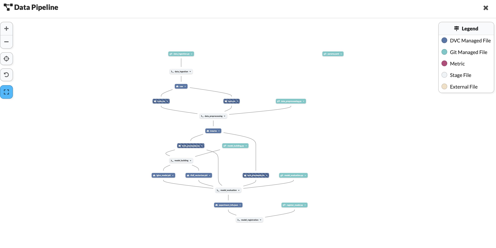
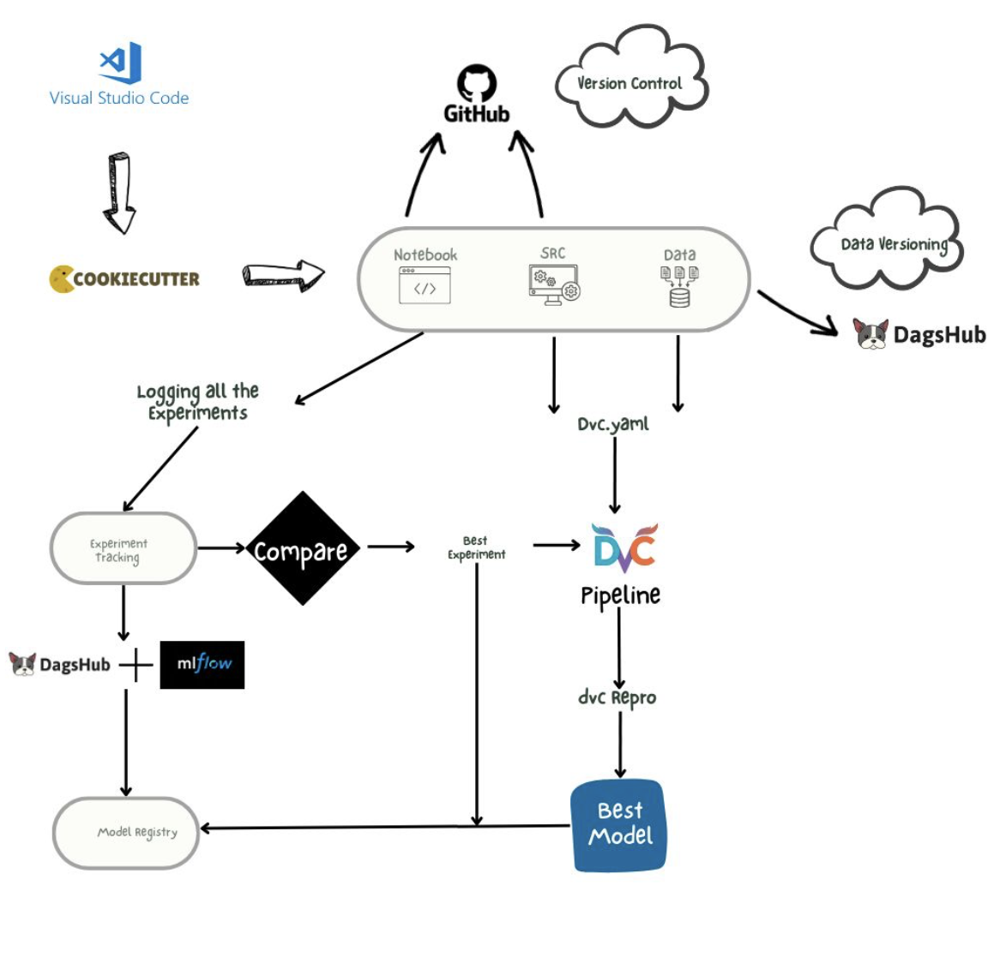
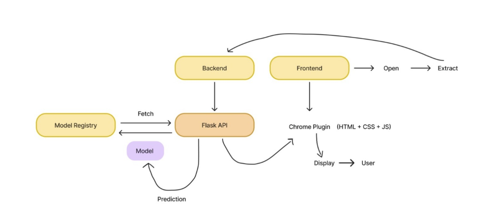

# youtube-chrome

<a target="_blank" href="https://cookiecutter-data-science.drivendata.org/">
    
</a>


## Project Organization

```
├── LICENSE            <- Open-source license if one is chosen
├── Makefile           <- Makefile with convenience commands like `make data` or `make train`
├── README.md          <- The top-level README for developers using this project.
├── data
│   ├── external       <- Data from third party sources.
│   ├── interim        <- Intermediate data that has been transformed.
│   ├── processed      <- The final, canonical data sets for modeling.
│   └── raw            <- The original, immutable data dump.
│
├── docs               <- A default mkdocs project; see www.mkdocs.org for details
│
├── models             <- Trained and serialized models, model predictions, or model summaries
│
├── notebooks          <- Jupyter notebooks. Naming convention is a number (for ordering),
│                         the creator's initials, and a short `-` delimited description, e.g.
│                         `1.0-jqp-initial-data-exploration`.
│
├── pyproject.toml     <- Project configuration file with package metadata for 
│                         src and configuration for tools like black
│
├── references         <- Data dictionaries, manuals, and all other explanatory materials.
│
├── reports            <- Generated analysis as HTML, PDF, LaTeX, etc.
│   └── figures        <- Generated graphics and figures to be used in reporting
│
├── requirements.txt   <- The requirements file for reproducing the analysis environment, e.g.
│                         generated with `pip freeze > requirements.txt`
│
├── setup.cfg          <- Configuration file for flake8
│
└── src   <- Source code for use in this project.
    │
    ├── __init__.py             <- Makes src a Python module
    │
    ├── config.py               <- Store useful variables and configuration
    │
    ├── dataset.py              <- Scripts to download or generate data
    │
    ├── features.py             <- Code to create features for modeling
    │
    ├── modeling                
    │   ├── __init__.py 
    │   ├── predict.py          <- Code to run model inference with trained models          
    │   └── train.py            <- Code to train models
    │
    └── plots.py                <- Code to create visualizations
```

--------

# Goal
The goal of the project is to develop a Youtube Chrome Plugin, This extention will empower the youtube influencer to understand the audience anc create content to increase the rech withoout paying a penny to makreting agencies. 

# Vision 
**You Not Just get TO the Audience but Get THROUGH the Audience**

YouTube influencers face a significant challenge: understanding audience preferences and content consumption patterns to boost engagement. While marketing agencies and advanced analytics tools provide data-driven insights, these solutions are often prohibitively expensive for many influencers.
As a result, influencers are left to manually analyze vast volumes of audience comments, a process that is not only time-consuming but also error-prone. With thousands of comments pouring in on each video, it becomes nearly impossible to identify and act on critical insights buried within the feedback. These missed opportunities could have otherwise informed content strategies, strengthened audience connections, and accelerated channel growth.
This tedious and inefficient process consumes valuable time and often leads to overlooked feedback that could have been instrumental in understanding audience needs and preferences. Influencers need a smarter, more accessible solution to unlock these insights efficiently and effectively.
The YouTube plugin application addresses two critical business metrics: marketing cost reduction and time efficiency.


# Appraoch 

**Initial Phase:**

Data Collection → Exploratory Data Analysis → Baseline Model → Experiment Tracking

**Second Phase:**

Monolithic Architecture:

Data Ingestion → Data Preprocessing → Model Training → Model Evaluation → Model Registration

**Third Phase:**

Develop a Flask API for model serving, and a plugin.


# Roadmap

First, I will provide a quick overview of the tool stack I will be using, followed by where each tool will be applied. I will also include the key libraries at a high level.

## 1. Tool Stack Used:

Data Versioning: DVC
Data Storage: DVC
Code Versioning: GitHub
Experiment Tracking: MLflow
Model Registry: MLflow
Hosting MLflow: Dagshub
CI/CD Workflow: GitHub Actions
Containerization: Docker
API: Flask
IDE: Visual Code

As discuss lets discuss more about phase one and phase 2.


## Phase 1 Flow  
We will use **Google Colab, MLflow, and Dagshub** to execute this phase.  
**Data Collection → Exploratory Data Analysis → Baseline Model → Experiment Tracking**  

### Data Collection  
The training and testing data is collected from **Kaggle**.  

- **Dataset Link:** https://raw.githubusercontent.com/Himanshu-1703/reddit-sentiment-analysis/refs/heads/main/data/reddit.csv  
- **Summary:**  
  - The dataset contains **comments and sentiment labels**.  
  - There are **three sentiment categories**: **Neutral, Positive, and Negative**.  

### Exploratory Data Analysis
Google Collab Link : https://colab.research.google.com/drive/1R-X0DBU8BPmGo3-Uf45uBw-5MtVMc-z5  
The primary libraries used for data cleaning and visualization are:  
- **textacy**  
- **pyLDAvis**  
- **WordCloud**  

#### Data Preprocessing Steps  
- **Duplicate and Null Value Handling**  
- **Text Normalization**  
- **Whitespace Removal**  
- **HTML Tags Removal**  
- **Punctuation Removal**  
- **Bracket Removal**  
- **Emoji Removal**  
- **Length-Based Filtering**  
- **Non-Meaningful Row Filtering**  

#### Summary of Insights  
- The dataset is **imbalanced**, so we need to apply techniques like **ADASYN** to address this issue.  
- **Stop words removal** was performed, but words like *not, but, or* (negative conjunctions) were **kept** to preserve sentiment.  
- Several **non-English words** were found in the dataset.  
- The **label distribution** does not vary significantly with **word count**. However, after **6,000 words**, most comments are **positive**, indicating that **longer comments tend to be positive**.  
- **Word cloud analysis** revealed a high presence of **political comments**, suggesting that the trained model will likely perform better on **political YouTube channels**.  

### BaseLine Model
Random Forest
On closely examining all the parameters, Accuracy shows a decent value of 0.81.
Whereas -1 recall has very poor performance. Hence we could interpret that the Making Too Much False Negative Mistake as what it means that it is not able to properly understand the -1 label data and stating it false. 


### Experiment Tracking

Experiment 1- Best Feature Engineering Technique like Bag of Words or TFIDF along with unigram, bigram and trigram
Result :
On increasing the n-grams the performance is deteriorating, So the 1-gram has the best performance out of all.
Moreover it was observed that the performance of the TF-IDF is better than the Bag of words irrespective of the n-gram, So Choosing TF-IDF and 1-gram for the Experiment as the best combination.


Based on analysis of the graph it is observed that TFIDF with ngram 1 has the best performance in terms of all f1 scores. 
And also the performance precision and recall is working well. The below runs for not removing stops from the multi gram tokenization, still the unigram was out-performing 


Experiment 2-  What would be the best max number of features for different engineering techniques?
	
Result: Observed a positive correlation between max_features and f1 scores till 5000.
If we observed the scatter plot we can see the max_feature is attaining maxima
somewhere between 2000 and 5000.


The below scatter plot suggests that the model is performing very nicely when max features is 4000. 


## Phase 2 Flow  

The primary goal of this phase is to **automate all tasks performed in Phase 1** using a **DVC pipeline**. The model will be **automatically pushed to the Model Registry** if it achieves an **accuracy above 85%**.  

Below is the **DAG of the pipeline**: 



Below is the *worflow including toolstack*: 



## Phase 3
### Chrome Plugin for YouTube Comments Fetcher

### Strategy to Build the Backend

1. **Create a Script to Check Model Prediction:**
   - Create a script to verify whether the model is properly loaded and able to give predictions.

2. **Build the Flask API:**
   - Develop a Flask API to handle requests for fetching YouTube video comments.

3. **Test the API with Postman:**
   - Use Postman to test the API and ensure it returns the expected results.

---

## Strategy to Build the Chrome Plugin

1. **Create a New Folder for the Chrome Plugin:**
   - Create a new directory where the Chrome plugin files will be stored.

2. **Start Building the Chrome Plugin:**
   - Develop the basic structure of your Chrome plugin using HTML, JavaScript, and CSS.

3. **Enable Developer Mode in Chrome:**
   - Open `chrome://extensions/` in your browser and turn on Developer Mode.

4. **Condition to Check YouTube URL:**
   - Implement a condition to check if the current tab's URL is from YouTube.
     - If it is a YouTube URL, fetch the video ID from the URL.
     - If the URL is not from YouTube, display an appropriate message, e.g., "This is not a YouTube URL."

5. **Fetch Comments from YouTube:**
   - Once the video ID is obtained, use the YouTube API to fetch comments for that video.

6. **Error Handling:**
   - If the URL is not from YouTube, display an error message saying, "Not a YouTube URL."

---

## Testing

- Once the plugin is built and the logic is in place, test the plugin by opening a YouTube video in Chrome and using the plugin to fetch the comments.

---

## Key Notes:
- Ensure that the YouTube API credentials are set up properly to allow access to video data.
- Handle errors and edge cases, such as invalid video IDs or restricted videos.


# Architecture

This simple-to-use Chrome plugin enables influencers to streamline their workflow. All they need to do is load the plugin, open a YouTube page, and let the tool analyze their video effortlessly. The plugin provides actionable insights without the need for complex setups or expensive analytics services.
Below is the general architecture:




